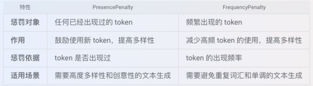
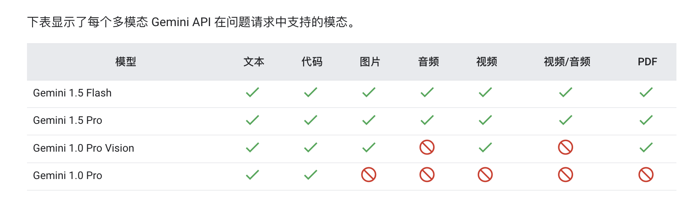

# 文档明细

**NOTE:** vertex-ai

0.[Overview of Generative AI on Vertex AI](https://cloud.google.com/vertex-ai/generative-ai/docs)

1.[Vertex AI release notes](https://cloud.google.com/vertex-ai/generative-ai/docs/release-notes)

2.[Generative AI on Vertex AI release notes](https://cloud.google.com/vertex-ai/generative-ai/docs/release-notes-archive)

3.[Generative AI on vertex AI guide](https://cloud.google.com/vertex-ai/generative-ai/docs/model-reference/inference)

4.[Model versions and lifecycle](https://cloud.google.com/vertex-ai/generative-ai/docs/learn/model-versions)

5.[Generative AI on Vertex AI language support and input/output upper limits ](https://cloud.google.com/vertex-ai/generative-ai/docs/learn/models?hl=zh-cn#gemini-models)

6.[Generative AI on Vertex AI locations](https://cloud.google.com/vertex-ai/generative-ai/docs/learn/locations#middle-east)

7.[Package cloud.google.com/go/vertexai/genai](https://cloud.google.com/vertex-ai/generative-ai/docs/reference/go/latest/genai#cloud_google_com_go_vertexai_genai_Client_CreateCachedContent)

8.[Generate AI parameters for GO SDK](https://cloud.google.com/vertex-ai/generative-ai/docs/reference/rpc/google.cloud.aiplatform.v1#google.cloud.aiplatform.v1.GenerateContentResponse)

9.[Generate AI Part](//https://cloud.google.com/vertex-ai/generative-ai/docs/reference/rpc/google.cloud.aiplatform.v1#google.cloud.aiplatform.v1.Part)

10.[Generate AI GenerationConfig](https://cloud.google.com/vertex-ai/generative-ai/docs/reference/rpc/google.cloud.aiplatform.v1#google.cloud.aiplatform.v1.GenerationConfig)

11.[Generate AI SafetySetting](https://cloud.google.com/vertex-ai/generative-ai/docs/model-reference/inference#safetysetting)

12.[Generate AI on vertex ai interface api errors code](https://cloud.google.com/vertex-ai/generative-ai/docs/model-reference/api-errors)

13.[Generate AI on vertex ai Type Struct](https://cloud.google.com/go/docs/reference/cloud.google.com/go/ai/latest/generativelanguage/apiv1/generativelanguagepb#variables)

14.[Samples and notebooks](https://cloud.google.com/vertex-ai/generative-ai/docs/samples/generativeaionvertexai-stream-multimodality-basic)

15.[Vertex AI quotas and limits](https://cloud.google.com/vertex-ai/docs/quotas)

16.[Generative AI on Vertex AI rate limits](https://cloud.google.com/vertex-ai/generative-ai/docs/quotas)

17.[How Gemini for Google Cloud uses your data](https://cloud.google.com/gemini/docs/discover/data-governance)

18.[SLA](https://cloud.google.com/vertex-ai/sla?hl=en)

19.[Vertex AI video-requirements](https://cloud.google.com/vertex-ai/generative-ai/docs/multimodal/video-understanding#video-requirements) Gemini multimodal models support the following video MIME types

20.[Vertex AI audio-requirements](https://cloud.google.com/vertex-ai/generative-ai/docs/multimodal/audio-understanding#audio-requirements) Gemini multimodal models support the following audio MIME types

21.[Vertex AI document-requirements](https://cloud.google.com/vertex-ai/generative-ai/docs/multimodal/document-understanding#document-requirements) Gemini multimodal models support the following document MIME types

22.[Vertex AI image-requirements](https://cloud.google.com/vertex-ai/generative-ai/docs/multimodal/image-understanding#image-requirements) Gemini multimodal models support the following image MIME types

```go
Vertex AI服务 及 Google Cloud 提供相关数据安全与隐私保护说明和证明。
参考：
https://cloud.google.com/terms
https://cloud.google.com/privacy/common-privacy-principles
https://cloud.google.com/sensitive-data-protection/docs/support/data-security?hl=zh-cn

提供 ISO27001资质证书
https://cloud.google.com/security/compliance/iso-27001?hl=zh-cn

其他相关合规认证参考：
https://cloud.google.com/security/compliance/offerings?hl=zh-cn
https://cloud.google.com/privacy/gdpr?hl=zh-cn
https://cloud.google.com/security/compliance/ccpa?hl=zh-cn
```

```go
Google Cloud 提供相关安全认证证明，服务符合行业标准。
ISO
https://cloud.google.com/security/compliance/iso-9001?hl=zh-cn
https://cloud.google.com/security/compliance/iso-27017?hl=zh-cn
https://cloud.google.com/security/compliance/iso-27018?hl=zh-cn

SOC 2/3
https://cloud.google.com/security/compliance/soc-2?hl=zh-cn
https://cloud.google.com/security/compliance/soc-3?hl=zh-cn

PCI DSS
https://cloud.google.com/security/compliance/pci-dss?hl=zh-cn

更多合规认证参考：
https://cloud.google.com/security/compliance/offerings?hl=zh-cn
```

```go
Google 运营着一个成熟、完备的漏洞管理流程，该流程使用商用和专用内部工具、密集的自动和手动渗透工作、质量保证流程、软件安全审查和外部审计的组合来主动扫描安全威胁。漏洞管理团队负责跟踪和跟进漏洞。一旦发现需要修复的漏洞，就会记录下来，根据严重程度确定优先级，并指定所有者。漏洞管理团队会跟踪此类问题并经常跟进，直到他们能够确认问题已得到修复。Google 还与安全研究社区的成员保持联系并进行交流，以跟踪 Google 服务和开源工具中报告的问题。

另外 Google 还提供漏洞奖励计划，鼓励外部安全研究人员报告潜在的技术漏洞。这些存在于归 Google 所有的浏览器扩展程序、移动应用和 Web 应用中的漏洞，可能会影响用户数据机密性或完整性，因此 Google 鼓励此类报告并给予奖金作为奖励。

同时 Google 的首要任务是维护客户数据的安全环境。为了帮助保护客户数据，我们运行着业界领先的信息安全操作系统，该操作流程结合了严格的流程、专家级突发事件响应团队以及多层信息安全和隐私基础架构。

参考：
Google Security Whitepaper:
https://cloud.google.com/security/whitepaper

Google Infrastructure Security Overview Whitepaper:
https://cloud.google.com/security/security-design/

Data Security:
https://cloud.google.com/terms/data-processing-terms

Google Cloud 中管理和响应数据突发事件的原则性方法
https://cloud.google.com/docs/security/incident-response?hl=zh-cn#data_incident_response_process_2

```

```go
1. PresencePenalty (存在惩罚)

作用: PresencePenalty 的作用是惩罚模型在生成文本中重复使用已经出现过的 token (词或子词)。它鼓励模型尝试使用新的、之前未出现过的 token，从而提高文本的多样性。

适用场景:
    当你希望模型生成更具创意、多样化的文本，避免简单重复时，可以适当调高 PresencePenalty 的值。
    例如，在头脑风暴、创意写作、生成不同风格的文本时比较有用。


2. FrequencyPenalty (频率惩罚)

作用: FrequencyPenalty 的作用是惩罚模型在生成文本中频繁使用某些 token。与 PresencePenalty 不同，它关注的是 token 出现的次数，而不是是否出现过。它鼓励模型减少高频词的使用，从而提高文本的多样性。

适用场景:
    当你希望模型避免重复使用某些高频词，生成更丰富、更自然的文本时，可以适当调高 FrequencyPenalty 的值。
    例如，在对话生成、文章写作、避免口水话时比较有用。

总结：
    PresencePenalty (存在惩罚)：
        负值： 惩罚已经出现过的 token，重复值越多，重复token越多
        0： 不进行惩罚，模型会按照其原始的概率分布进行选择
        正值： 鼓励模型避免重复已出现过的token，重复值越少，越容易生成新的token
    FrequencyPenalty (频率惩罚)：
        负值： 惩罚出现频率低的 token，频率越低，重复token越多
        0： 不进行惩罚，模型会按照其原始的概率分布进行选择
        正值： 惩罚重复性高的 token，重复值越少，越容易生成新的token
```




